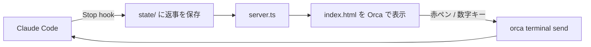

# rmv (Red Marker Viewer)

Claude Code の返事を、[Orca](https://github.com/stablyai/orca) のフローティングブラウザで「見て分かる」形に描き、赤ペンで端末へ返すビューアです。


[高画質の動画 (mp4)](docs/demo.mp4)

## なぜ作ったか

ターミナルの Claude Code では、返事に出てくる画像がその場で見られません。
mermaid の図も、コードのまま表示されます。
Orca には実験的なチャット表示がありますが、不安定です。
そこで、返事だけを描くページを横に置いたり、ショトカで表出させることにしました。

「赤ペン」は、まさおさんの [akapen](https://github.com/AI-Driven-R-D-Dept/akapen) へのリスペクトです。
akapen は、作る前に 1 案を人に見せて、赤 (回答・訂正) をもらってから作る skill です。
rmv では、その赤を入れる体験を毎回の返事に持ち込んでいます。

## 僕の使い方

Orca のフローティングブラウザに rmv を開いておきます。（chrome等でも見れますが、vimium等ショートカットの競合注意）

| 操作 | 何が起きるか |
| --- | --- |
| `cmd+J` | フローティングブラウザが即立ち上がり、最新の返事が見える |
| `↑` `↓` | セッション を切り替える |
| `←` `→` | 返事の履歴を過去へさかのぼる / 新しい方へ戻る |
| `1`〜`6` | その端末へ即返答 (1 = ok / 2 = continue / 3 = A / 4 = B / 5 = C / 6 = land) |
| 段落をクリック | 赤ペンのピンが立つ。ひとこと書いて送信すると、その端末へ打ち込まれて端末タブに戻る |

選択肢の表 (A / B / C) を見て数字キーを 1 回押せば、端末に戻らずに返事ができます。
1~6の選択肢は皆さんのよく使うものに置き換えてください。
長い指摘は、段落ごとに赤ペンを付けてまとめて送ります。


赤ペンのチェックはescで外せます。

左の列はプロジェクトの一覧です。基本はホバー開閉です。
複数の repo で Claude を並走させていても、返事が来た順に並びます。


右のチャット欄からは、自由文を端末へ送れます。
`/` を打つと skill とコマンドの候補が出て、`↑` `↓` で選び `Tab` か `Enter` で入ります。
候補の出どころは、送り先の repo の skill・自分の skill・plugin・組み込みコマンドの 4 つです。


## Low-Load 出力スタイルと組み合わせる

rmv は、同梱の出力スタイル [Low-Load](output-styles/low-load.md) の書式を、毎回同じ位置に描きます。

| 返事の書式 | rmv での見え方 |
| --- | --- |
| `1.` `2.` の段落番号 | 左の丸番号。段ごとにカードになる |
| `ⅰ` `ⅱ` の箇条書き | 字下げした項目 |
| 🔴 🟡 🟢 | 段の左の色帯 (🔴 は赤帯) |
| 選択肢の表 | 表 + [これにする] ボタン |
| mermaid | 図として描画 (押すと全画面) |
| `検証:` `DECIDE:` の行 | 下端の小さな注記 |
| 画像・動画の絶対パス | その場に表示 |


シーケンス図も、端末では出ない図としてそのまま描けます。


1 行に画像のパスを複数書くと、横に並べて表示します。
スクショの前後比較や、画面ごとに 1 枚ずつ並べる時に便利です。


出力スタイルの入れ方:

```bash
mkdir -p ~/.claude/output-styles
cp output-styles/low-load.md ~/.claude/output-styles/
```

Claude Code の `/config` で Output style に `Low-Load` を選びます。
書式を AI 任せにせず固定の型に寄せているので、ページの見た目が毎回ぶれません。

## 仕組み



AI には HTML を書かせません。
返事の markdown をそのまま保存し、決まった型のページが 2 秒ごとに取り込んで描きます。

## セットアップ

必要なもの: macOS / [Bun](https://bun.sh) / python3 / Claude Code / Orca (赤ペンと数字キーの送信に使う。無くても閲覧はできる)

1. clone して server を起動します。

   ```bash
   git clone https://github.com/ktsm-yt/rmv.git ~/rmv
   cd ~/rmv && bun run server.ts
   ```

2. Claude Code の `~/.claude/settings.json` の `hooks` に、返事を保存する hook を足します。
   パスは clone した場所に合わせてください。

   ```json
   {
     "hooks": {
       "Stop": [
         { "hooks": [{ "type": "command", "command": "python3 ~/rmv/hooks/stop-to-fragment.py", "timeout": 5 }] }
       ],
       "SubagentStop": [
         { "hooks": [{ "type": "command", "command": "python3 ~/rmv/hooks/stop-to-fragment.py", "timeout": 5 }] }
       ]
     }
   }
   ```

   `SubagentStop` は任意です。
   入れると、上部の「🤖 ワーカー」タブで subagent の報告も読めます。

3. Orca のフローティングブラウザで `http://127.0.0.1:4310` を開きます。
   ポートは環境変数 `RMX_PORT` で変えられます。

常駐させたい時は、launchd などで `bun run server.ts` を起動しっぱなしにしてください。

## 注意

- server は `127.0.0.1` だけで待ち受けます。
  認証は無いので、LAN に公開しないでください。
- 返事に出てきたファイルを表示するため、ホーム配下と一時ディレクトリの画像・動画・md などを読みます。
- 返事の履歴は `state/` に直近 200 件まで残ります。

テスト:

```bash
bash test/akapen.test.sh
```

## ライセンス

MIT
