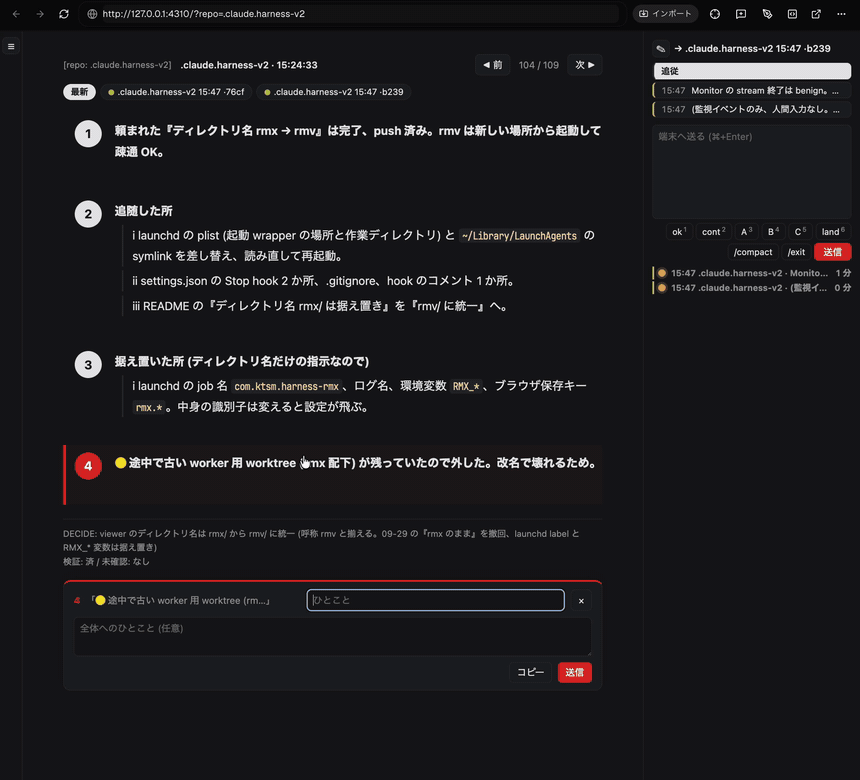
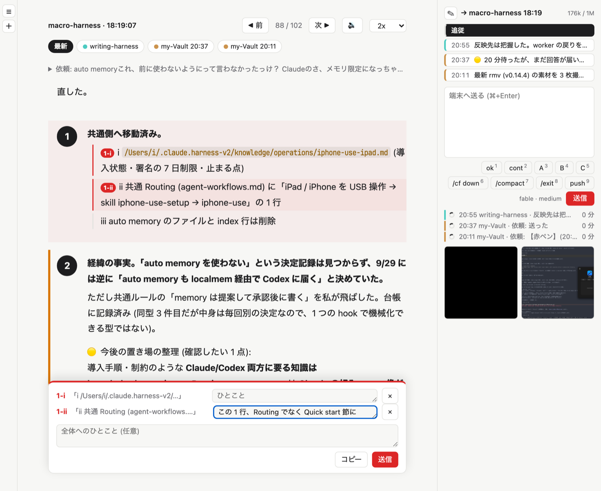
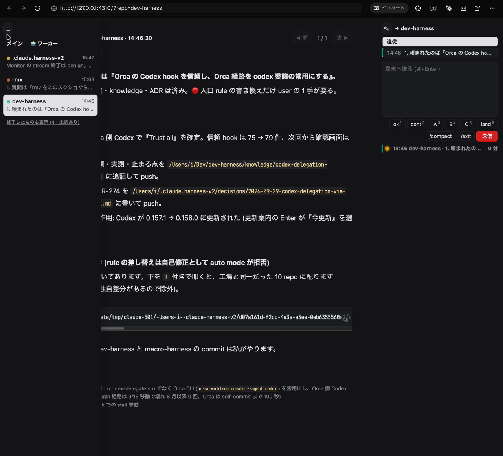
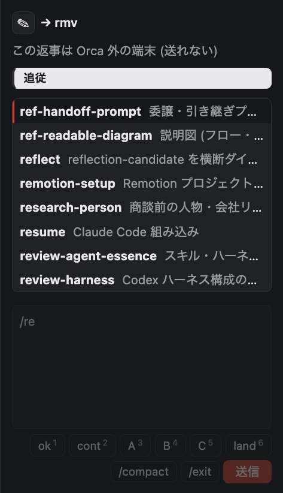
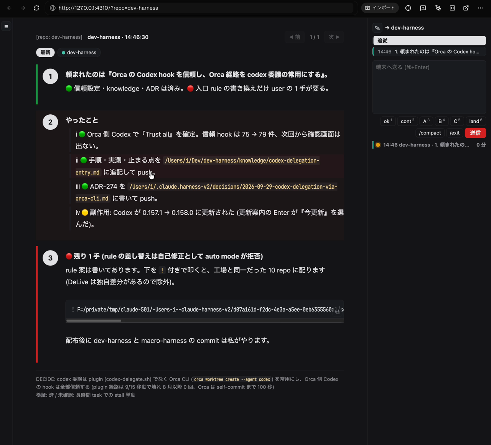
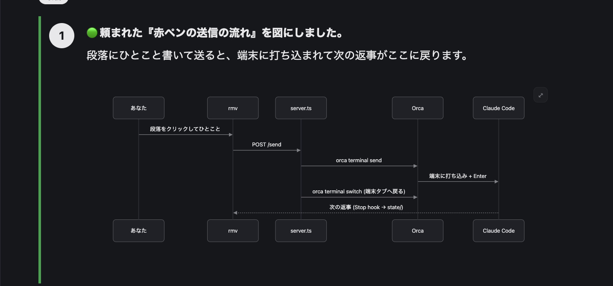
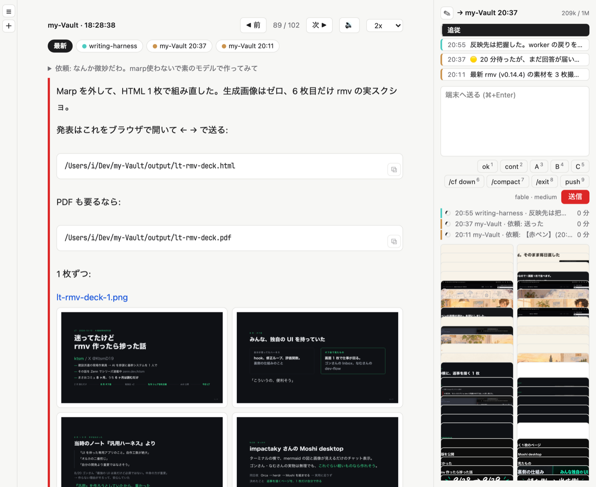
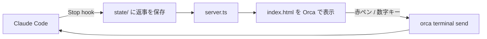

# rmv (Red Marker Viewer)

Claude Code の返事を、[Orca](https://github.com/stablyai/orca) のフローティングブラウザで「見て分かる」形に描き、赤ペンでそのセッションへ返すビューアです。
（chrome等でも見れますが、vimium等ショートカットの競合注意）



[高画質の動画 (mp4)](docs/demo.mp4)

## なぜ作ったか

ターミナルの Claude Code では、返事に出てくる画像がその場で見られません。
mermaid の図も、コードのまま表示されます。
Orca には実験的なチャット表示がありますが、不安定です。
そこで、返事だけを描くページを横に置いたり、ショトカで表出させることにしました。

「赤ペン」は、まさおさんの [akapen](https://github.com/AI-Driven-R-D-Dept/akapen) へのリスペクトです。
akapen は、作る前に 1 案を人に見せて、赤 (回答・訂正) をもらってから作る skill です。
rmv では、その赤を入れる体験を毎回の返事に持ち込んでいます。

## 僕の使い方

Orca のフローティングブラウザに rmv を開いておきます。

| 操作 | 何が起きるか |
| --- | --- |
| `cmd+J` (Orca) | フローティングブラウザが即立ち上がり、最新の返事が見える |
| `←` `→` | 返事の履歴を過去へさかのぼる / 新しい方へ戻る |
| `↑` `↓` | セッションを切り替える |
| `1`〜`5` | そのセッションへ即返答 (1 = ok / 2 = continue / 3 = A / 4 = B / 5 = C) |
| `6`〜`0` | 好きなコマンドを送る (既定は 6 = /compact / 7 = /exit) |
| `y` | 許可待ちの「許可」ボタンを押す (送り先のセッションの分。無ければ許可待ちが 1 つだけの時) |
| 段落をクリック | 赤ペンのピンが立つ。ひとこと書いて送信すると、そのセッションへ打ち込まれ、そのタブに戻る |
| `r` (🔊 ボタン) | 表示中の返事を声で読み上げる。もう一度押すと止まる (コード・表・図は読まない)。速さは 🔊 の隣で 1x〜3x から選ぶ (既定 2x、選んだ値を覚える) |
| `Shift+R` | 読み上げを一時停止する。もう一度押すと続きから読む |
| `Esc` | 赤ペンのピンを新しいものから 1 つ外す (ひとことを書いたピンで止まる) |
| `⌘Enter` | 赤ペンやチャット欄に書いたものを送信する |
| ギャラリーのカードを押す | 全画面で開く。`←` `→` で前後の図・画像へ送り、`Esc` で閉じる |

選択肢の表 (A / B / C) を見て数字キーを 1 回押せば、セッションに戻らずに返事ができます。
6〜0 には、皆さんのよく使うコマンドを置いてください。
`state/keys.json` に `{"6": "/cf down", "7": "/compact", "8": "/exit"}` のように書くと、その番号のボタンとキーになります (ページを開き直すと反映。`""` で既定を消す。1〜5 も同じ書き方で置き換えられる。`state/` は git に入りません)。
送信ボタンの左には、送り先セッションの今のモデルとエフォートが「opus · high」の形で表示だけされます (切り替えは Orca / 端末側。rmv からは `/model` `/effort` を送りません)。値は server の `GET /now` から (transcript の最後の `/model` `/effort` と assistant 行、モデルは無ければ `~/.claude/settings.json` の `"model"`。環境変数 `RMX_CC_SETTINGS` で場所を変えられます)。取り直しは送り先が変わった時と新しい返事が来た時で、端末で直接変えた分は次の返事で反映されます。チャット欄の見出しの右には、その時点の context 使用量が「268k / 1M」の形で出ます (`/now` の `ctx`。上限は model が `[1m]` で終われば 100 万、それ以外は 20 万の推定。30% 以上で黄、50% 以上で赤)。
長い指摘は、段落ごとに赤ペンを付けてまとめて送ります。
キーは入力欄の外で押します (`↑` `↓` と `1`〜`6` は、チャット欄が空なら欄の中でも使えます)。



左の列はプロジェクトの一覧です。基本はホバー開閉です。
複数の repo で Claude を並走させていても、返事が来た順に並びます。



右のチャット欄からは、自由文をセッションへ送れます。
`/` を打つと skill とコマンドの候補が出て、`↑` `↓` で選び `Tab` か `Enter` で入ります。
候補の出どころは、送り先の repo の skill・自分の skill・plugin・組み込みコマンドの 4 つです。



チャット欄には、クリップボードの画像を `⌘V` で貼れます。
送ると、Claude Code の入力欄に `[Image #N]` として届きます。

### ギャラリー

右下には、送り先のセッションで使った画像・PDF と、返事に出てきた mermaid 図がカードで並びます。
図も画像も、セッションで出てきた順に混ぜて、新しいものから並べます (図は直近 30 件の返事から最大 20 枚)。
PDF は押すと新しいタブで開きます。

## Low-Load 出力スタイルと組み合わせる

rmv は、同梱の出力スタイル [Low-Load](output-styles/low-load.md) の書式を、毎回同じ位置に描きます。

| 返事の書式 | rmv での見え方 |
| --- | --- |
| `1\.` `2\.` の段落番号 | 左の丸番号。段ごとにカードになる |
| `ⅰ` `ⅱ` の箇条書き | 字下げした項目 |
| 🔴 🟡 🟢 | 段の左の色帯 (🔴 は赤帯) |
| 選択肢の表 | 表 + [これにする] ボタン |
| mermaid | 図として描画 (押すと全画面) |
| `検証:` `DECIDE:` の行 | 下端の小さな注記 |
| 画像・動画の絶対パス | その場に表示 |



シーケンス図も、ターミナルでは出ない図としてそのまま描けます。



1 行に画像のパスを複数書くと、横に並べて表示します。
スクショの前後比較や、画面ごとに 1 枚ずつ並べる時に便利です。



出力スタイルの入れ方:

```bash
mkdir -p ~/.claude/output-styles
cp output-styles/low-load.md ~/.claude/output-styles/
```

Claude Code の `/config` で Output style に `Low-Load` を選びます。
書式を AI 任せにせず固定の型に寄せているので、ページの見た目が毎回ぶれません。

## 仕組み



AI には HTML を書かせません。
返事の markdown をそのまま保存し、決まった型のページが 2 秒ごとに取り込んで描きます。

## セットアップ

必要なもの: macOS / [Bun](https://bun.sh) / python3 / Claude Code / Orca (赤ペンと数字キーの送信に使う。無くても閲覧はできる)

1. clone して server を起動します。

   ```bash
   git clone https://github.com/ktsm-yt/rmv.git ~/rmv
   cd ~/rmv && bun run server.ts
   ```

2. Claude Code の `~/.claude/settings.json` の `hooks` に、返事を保存する hook を足します。
   パスは clone した場所に合わせてください。

   ```json
   {
     "hooks": {
       "Stop": [
         { "hooks": [{ "type": "command", "command": "python3 ~/rmv/hooks/stop-to-fragment.py", "timeout": 5 }] }
       ],
       "SubagentStop": [
         { "hooks": [{ "type": "command", "command": "python3 ~/rmv/hooks/stop-to-fragment.py", "timeout": 5 }] }
       ]
     }
   }
   ```

   `SubagentStop` は任意です。
   入れると、上部の「🤖 ワーカー」タブで subagent の報告も読めます。

   許可ダイアログで止まった端末を状態行に出して「許可」ボタンで通したい時は、同じ `hooks` に `perm-state.py` も足します (任意)。
   `PermissionRequest` で許可待ちを記録し、それ以外のイベントで消します。

   ```json
   {
     "hooks": {
       "PermissionRequest": [
         { "hooks": [{ "type": "command", "command": "python3 ~/rmv/hooks/perm-state.py", "timeout": 5 }] }
       ],
       "PostToolUse": [
         { "hooks": [{ "type": "command", "command": "python3 ~/rmv/hooks/perm-state.py", "timeout": 5 }] }
       ],
       "Stop": [
         { "hooks": [{ "type": "command", "command": "python3 ~/rmv/hooks/stop-to-fragment.py", "timeout": 5 }, { "type": "command", "command": "python3 ~/rmv/hooks/perm-state.py", "timeout": 5 }] }
       ],
       "UserPromptSubmit": [
         { "hooks": [{ "type": "command", "command": "python3 ~/rmv/hooks/perm-state.py", "timeout": 5 }] }
       ]
     }
   }
   ```

   `Stop` は上の返事保存と同じ配列に並べます (別の `Stop` を書くと上書きになります)。

   送った依頼文を返事の上に 1 行で出したい時は、`UserPromptSubmit` の配列に `python3 ~/rmv/hooks/prompt-state.py` も並べます (任意)。
   返事が来るまでは右欄の状態行に「依頼: 冒頭…」と出ます。

3. Orca のフローティングブラウザで `http://127.0.0.1:4310` を開きます。
   ポートは環境変数 `RMX_PORT` で変えられます。

常駐させたい時は、launchd などで `bun run server.ts` を起動しっぱなしにしてください。

### スマホなど別の端末から開く (任意)

rmv は Mac の中 (`127.0.0.1`) でしか待ち受けません。
別の端末から開く時は、Tailscale の `tailscale serve` に中継させ、その URL を環境変数 `RMX_ORIGINS` で許可します。

```bash
tailscale serve --bg 4310                # https://<Mac の名前>.<tailnet>.ts.net → 127.0.0.1:4310
RMX_ORIGINS=https://<Mac の名前>.<tailnet>.ts.net bun run server.ts
```

launchd で常駐させている時は、`RMX_ORIGINS=…` の行を `state/env` に書けば起動スクリプトが読みます。
届くのは同じ Tailscale につながった端末だけです。
返事の中のファイルを開くボタンは、押した端末でなく Mac の画面で開きます。

### 新しい Claude Code セッションを起動する

左のプロジェクト列の ☰ の真下の ＋ (列が広がっている時は右に「新規セッション」と出ます) を押すと、Orca の worktree の一覧が開きます。
行を押すとそのフォルダで、まっさらな Claude Code が Orca の新しい端末タブで起動します。
先頭は今選んでいるプロジェクト (「選択中」の印)、残りは最近返事があった順で、worktree は親の下に字下げして出ます。

`POST /new {cwd}` は、Orca の新しい端末タブでまっさらな Claude Code を起動します (`orca terminal create --worktree path:<cwd> --command claude --focus`)。
`cwd` は `orca worktree list` に載っている path と完全一致する時だけ受け付け、それ以外は 403 です (viewer と同じ Origin だけ許可)。
候補の一覧は `GET /worktrees` で取れます (60 秒 memo)。

- `RMX_NEW_CMD`: 端末で走らせるコマンド (既定 `claude`)
- `RMX_NEW_MODE`: `tab` (既定、新しいタブ) / `split` (選んだフォルダで開いている端末を下に分割。画面の送り先がそのフォルダならそれ、違えば同じフォルダの別の端末。そのフォルダに端末が 1 つも無い時は tab)

### 読み上げの声 (任意)

🔊 は Gemini の読み上げモデルで声を作ります。
キーは macOS のキーチェーンに入れます (値は対話で入力するので、シェルの履歴に残りません)。

```bash
security add-generic-password -U -a "$USER" -s rmv-gemini -w
```

環境変数 `GEMINI_API_KEY` に入れても使えます。キーが無い時や Gemini が失敗した時は、ブラウザ内蔵の声で読みます。
無料枠のキーでは、送った文章が Google の製品改善に使われます。
有料か無料かはキーの属する Google Cloud プロジェクトの支払い設定で決まり、rmv 側に切り替えはありません。

- `RMX_TTS_MODEL`: 読み上げモデル (既定 `gemini-3.1-flash-tts-preview`。`gemini-3.8-flash-tts` は声が良いが無料枠が 1 日 10 回)
- `RMX_TTS_VOICE`: 声 (既定 `Kore`)
- `RMX_TTS_STYLE`: 話し方の指示 (既定 `落ち着いて、はっきりと`。3.8 のときだけ効く)

## 注意

- server は `127.0.0.1` だけで待ち受けます。
  認証は無いので、LAN に公開しないでください。
- 返事に出てきたファイルを表示するため、ホーム配下と一時ディレクトリの画像・動画・pdf などを読みます。`.md` や `.code-workspace` などは読まずに Mac の既定アプリで開きます。スクリプト (`.sh` `.py`、実行ビット付き、`#!` 始まり) だけは実行させないよう、`RMX_EDITOR_APP` (既定 `Visual Studio Code`) で開きます。
- 返事の履歴は `state/` に直近 200 件まで残ります。

テスト:

```bash
bash test/akapen.test.sh
```

## ライセンス

MIT
