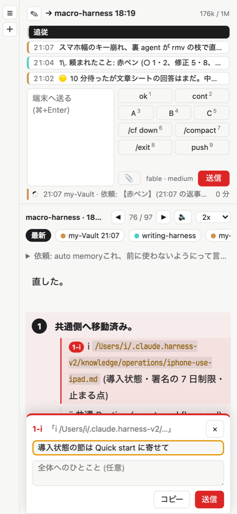
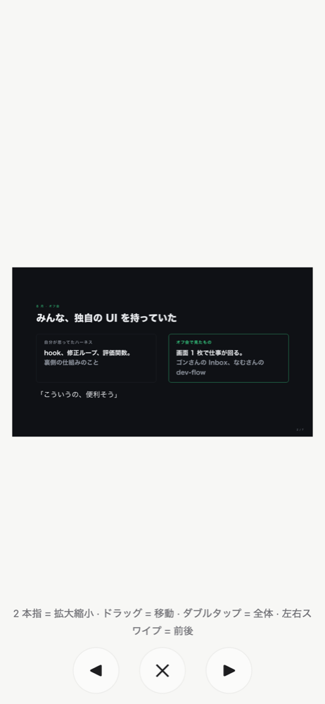

# 細かい設定と任意の機能

README の続きです。
どれも入れなくても rmv は使えます。

## キーの割り当て

`state/keys.json` に書くと、数字キーとボタンを置き換えられます。

```json
{"6": "/cf down", "7": "/compact", "8": "/exit"}
```

ページを開き直すと反映されます。
`""` を書くと、その番号の既定を消します。
`1`〜`5` も同じ書き方で置き換えられます。
`state/` は git に入りません。

キー操作の細かい挙動:

- `↑` `↓` は、チャット欄が空なら欄の中でも使えます。`1`〜`0` は欄の外だけです。
- 赤ペンを送ると、Orca はそのセッションのタブに移ります。
- `Esc` は、ひとことを書いたピンで止まります。
- `y` は、送り先のセッションの許可待ちを押します。送り先に許可待ちが無い時は、許可待ちが 1 つだけならそれを押します。
- `/` の候補の出どころは、送り先の repo の skill・自分の skill・plugin・組み込みコマンドの 4 つです。`↑` `↓` で選び、`Tab` か `Enter` で入ります。

## チャット欄の表示

送信ボタンの左には、送り先のモデルとエフォートが「opus · high」の形で出ます。
表示するだけで、切り替えは Orca か端末で行います。
端末で直接変えた分は、次の返事で反映されます。
モデルが transcript から分からない時は `~/.claude/settings.json` の `"model"` を読みます。場所は環境変数 `RMX_CC_SETTINGS` で変えられます。

見出しの右には、context の使用量が「268k / 1M」の形で出ます。
30% 以上で黄、50% 以上で赤になります。

## ギャラリー

図も画像も、セッションで出てきた順に混ぜて、新しいものから並べます。
図は直近 30 件の返事から最大 20 枚です。
PDF は押すと新しいタブで開きます。

## 許可ボタンを使う

許可ダイアログで止まった端末を状態行に出し、「許可」ボタンか `y` で通せるようにします。
`~/.claude/settings.json` の `hooks` に `perm-state.py` を足します。

```json
{
  "hooks": {
    "PermissionRequest": [
      { "hooks": [{ "type": "command", "command": "python3 ~/rmv/hooks/perm-state.py", "timeout": 5 }] }
    ],
    "PostToolUse": [
      { "hooks": [{ "type": "command", "command": "python3 ~/rmv/hooks/perm-state.py", "timeout": 5 }] }
    ],
    "Stop": [
      { "hooks": [{ "type": "command", "command": "python3 ~/rmv/hooks/stop-to-fragment.py", "timeout": 5 }, { "type": "command", "command": "python3 ~/rmv/hooks/perm-state.py", "timeout": 5 }] }
    ],
    "UserPromptSubmit": [
      { "hooks": [{ "type": "command", "command": "python3 ~/rmv/hooks/perm-state.py", "timeout": 5 }] }
    ]
  }
}
```

`Stop` は、README で足した返事保存と同じ配列に並べます。
別の `Stop` を書くと上書きになります。

## 依頼文を返事の上に出す

`UserPromptSubmit` の配列に `python3 ~/rmv/hooks/prompt-state.py` を並べます。
送った依頼文が、返事の上に 1 行で出ます。
返事が来るまでは、右欄の状態行に「依頼: 冒頭…」と出ます。

## 新しいセッションを起動する

左の列の ☰ の真下にある ＋ を押すと、Orca の worktree の一覧が開きます。
行を押すと、そのフォルダでまっさらな Claude Code が Orca の新しい端末タブで起動します。
一覧の先頭は今選んでいるプロジェクト、残りは最近返事があった順です。

- `RMX_NEW_CMD`: 端末で走らせるコマンド (既定 `claude`)
- `RMX_NEW_MODE`: `tab` (既定、新しいタブ) / `split` (そのフォルダで開いている端末を下に分割。端末が無ければ tab)

## スマホなど別の端末から開く

rmv は Mac の中 (`127.0.0.1`) でしか待ち受けません。
別の端末から開く時は、Tailscale の `tailscale serve` に中継させ、その URL を環境変数 `RMX_ORIGINS` で許可します。

```bash
tailscale serve --bg 4310                # https://<Mac の名前>.<tailnet>.ts.net → 127.0.0.1:4310
RMX_ORIGINS=https://<Mac の名前>.<tailnet>.ts.net bun run server.ts
```

launchd で常駐させている時は、`RMX_ORIGINS=…` の行を `state/env` に書けば起動スクリプトが読みます。
届くのは同じ Tailscale につながった端末だけです。
返事の中のファイルを開くボタンは、押した端末には出ず、Mac の画面で開きます。

スマホ幅では、チャット欄とクイックキーが上、返事が下に並びます。
赤ペンは PC と同じで、段をタップしてひとことを添えます。



画像や図をタップすると全画面になり、左右スワイプか ◀ ▶ で前後の画像に移れます。



## 読み上げの声

🔊 は Gemini の読み上げモデルで声を作ります。
キーは macOS のキーチェーンに入れます (値は対話で入力するので、シェルの履歴に残りません)。

```bash
security add-generic-password -U -a "$USER" -s rmv-gemini -w
```

環境変数 `GEMINI_API_KEY` に入れても使えます。
キーが無い時や Gemini が失敗した時は、ブラウザ内蔵の声で読みます。
Android の Chrome の内蔵の声は一時停止できません。

無料枠のキーでは、送った文章が Google の製品改善に使われます。
有料か無料かは、キーの属する Google Cloud プロジェクトの支払い設定で決まります。

🔊 ボタンの操作:

- 読み上げ中に押すと一時停止 / 再開、長押しで止まります。
- 速さは隣で 1x〜3x から選びます (既定 2x、選んだ値を覚えます)。
- コード・表・図は読みません。

環境変数:

- `RMX_TTS_MODEL`: 読み上げモデル (既定 `gemini-3.1-flash-tts-preview`。`gemini-3.8-flash-tts` は声が良いが無料枠が 1 日 10 回)
- `RMX_TTS_VOICE`: 声 (既定 `Kore`)
- `RMX_TTS_STYLE`: 話し方の指示 (既定 `落ち着いて、はっきりと`。3.8 のときだけ効く)

## 返事に出てきたファイルの扱い

画像・動画・PDF などは、ホーム配下と一時ディレクトリにあればページの中に表示します。
`.md` や `.code-workspace` などは読まずに、Mac の既定アプリで開きます。
スクリプト (`.sh` `.py`、実行ビット付き、`#!` 始まり) は実行させないよう、`RMX_EDITOR_APP` (既定 `Visual Studio Code`) で開きます。

## ポート

既定は `4310` です。
環境変数 `RMX_PORT` で変えられます。
